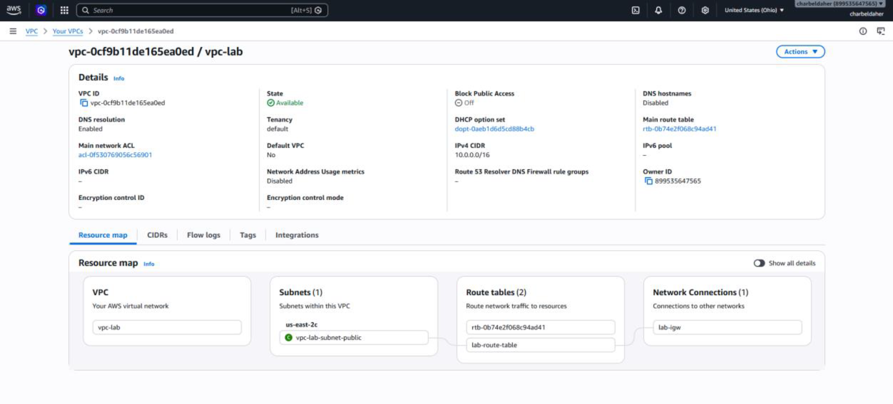
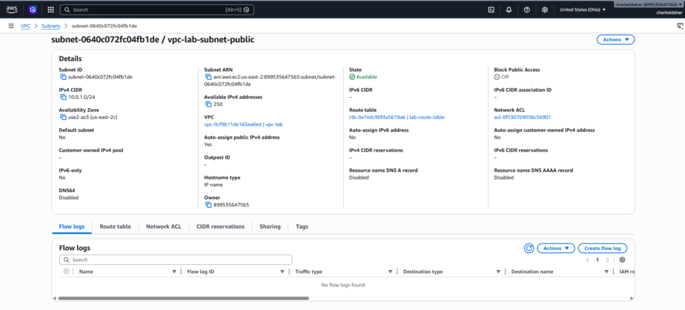
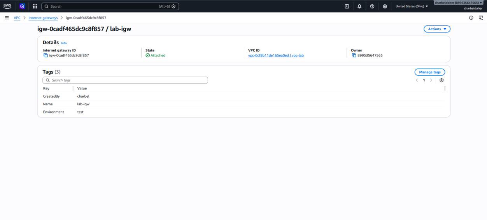
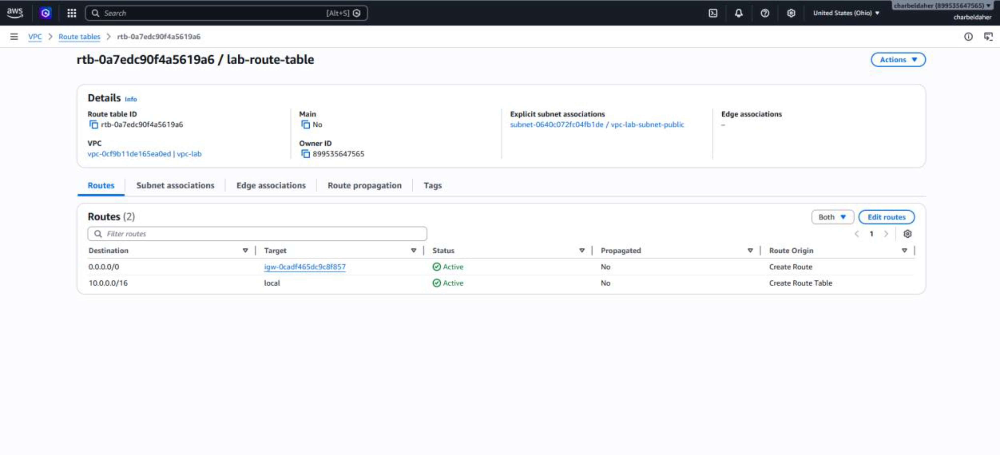
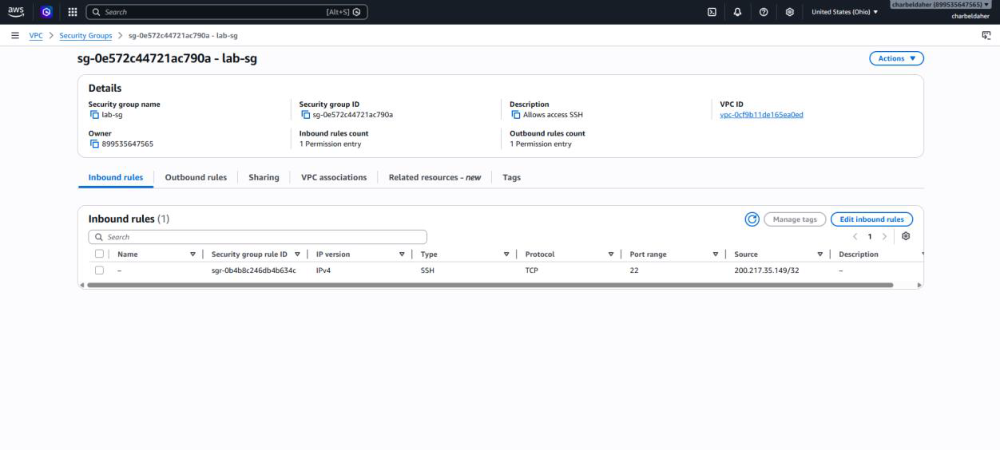
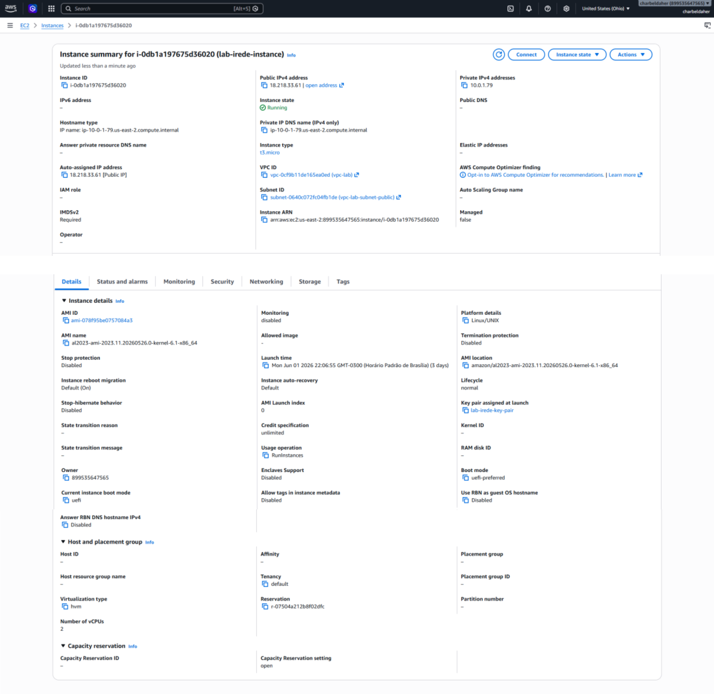
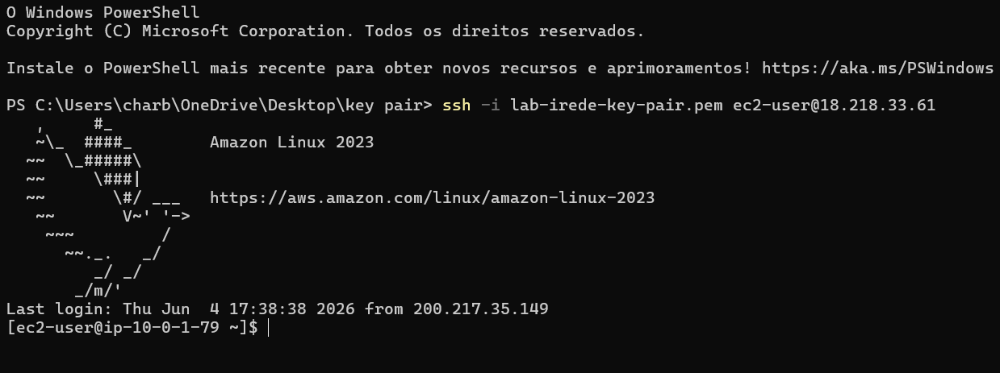

# ☁️ Laboratório AWS - Infraestrutura Básica


## 📋 Objetivo

Criar manualmente uma infraestrutura básica na AWS utilizando o Console Web para compreender como os principais serviços de rede e computação se conectam para disponibilizar uma aplicação acessível pela internet.

---

## 🏗️ Arquitetura da Solução

```text
Internet
    │
    ▼
Internet Gateway
    │
    ▼
Route Table
    │
    ▼
Public Subnet
(10.0.1.0/24)
    │
    ▼
EC2 Amazon Linux 2
    │
    ▼
SSH (Porta 22)
```

---

## 🚀 Recursos Criados

### VPC

CIDR:

```text
10.0.0.0/16
```

Rede virtual isolada responsável por hospedar toda a infraestrutura.

---

### Subnet Pública

CIDR:

```text
10.0.1.0/24
```

Responsável por disponibilizar IP público para a instância EC2.

---

### Internet Gateway

Permite a comunicação da VPC com a Internet.

---

### Route Table

Rota configurada:

```text
0.0.0.0/0 → Internet Gateway
```

---

### Security Group

Regra criada:

```text
SSH - Porta 22
Origem: Meu IP
```

Garantindo acesso seguro à instância.

---

### EC2

Configuração:

```text
Amazon Linux 2
Tipo: t2.micro
```

---

## 📸 Evidências

### VPC



### Subnet



### Internet Gateway



### Route Table



### Security Group



### EC2



### SSH Funcionando



---

## 🔐 Teste de Conectividade

Comando utilizado:

```bash
ssh -i lab-irede-key-pair.pem ec2-user@IP_PUBLICO
```

Conexão realizada com sucesso.

---

## 🎓 Aprendizados

Durante este laboratório foi possível compreender:

* Criação de redes na AWS utilizando VPC;
* Configuração de Subnets Públicas;
* Utilização de Internet Gateway;
* Configuração de Route Tables;
* Controle de acesso através de Security Groups;
* Provisionamento de instâncias EC2;
* Acesso remoto utilizando SSH.

---

## 👨‍💻 Autor

Charbel Daher

Curso: Computação em Nuvem

Programa: Capacita iRede TIC 20

